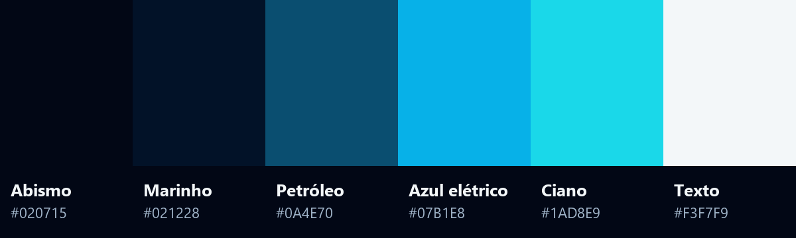

# Identidade visual @devbygusta

Padrões visuais e de conteúdo do perfil @devbygusta no Instagram: paleta, capas com personagem em 3D, carrossel "cena a cena", prompts de geração de imagem, roteiros e o processo de publicação.

## O que tem nesta pasta

| Arquivo | Conteúdo |
|---|---|
| [`prompts.md`](prompts.md) | Prompts prontos pra Magnific: capa, cena sem texto, poses e personagem original |
| [`carrosseis.md`](carrosseis.md) | Roteiros, legendas e ordem de publicação dos carrosséis |
| [`figma/montar-slides-cena-a-cena.js`](figma/montar-slides-cena-a-cena.js) | Script do Figma que monta degradês, chrome, copy e chip dos slides internos |
| [`skills/instagram-carousel/SKILL.md`](skills/instagram-carousel/SKILL.md) | Skill do Claude Code que cria os carrosséis seguindo esse padrão |
| `assets/` | Paleta e o cenário-assinatura |

## Paleta

| Nome | Hex | Uso |
|---|---|---|
| Abismo | `#020715` | Fundo dos slides e dos degradês de leitura |
| Marinho | `#021228` | Fundo secundário |
| Petróleo | `#0A4E70` | Profundidade, sombras coloridas |
| Azul elétrico | `#07B1E8` | Glow, linha de cima da capa |
| Ciano | `#1AD8E9` | Eyebrow, palavra de destaque no título, chip |
| Texto | `#F3F7F9` | Títulos e corpo |

A paleta saiu das capas que já estavam no Figma (frame `novas capas`). Na Magnific ela existe como a Cor `devbygusta`, com as quatro do meio.

## Tipografia

- **Slides internos:** Figtree. Eyebrow ExtraBold 26 em caixa alta (letterSpacing 8%), título Black 96 (lineHeight 96%, letterSpacing -2%), corpo Regular 38 a 80% de opacidade (lineHeight 140%).
- **Capas:** título branco condensado gigante, gerado dentro da imagem.
- Uma palavra de destaque por título, sempre em ciano.

## A capa

A capa sai pronta da Magnific, com texto dentro da imagem:

- personagem famoso renderizado como filme 3D (estilo Pixar), com expressão exagerada, ocupando o terço de baixo;
- linha pequena em caixa alta no topo, às vezes em azul elétrico;
- título branco condensado em duas linhas, com a última palavra passando atrás da cabeça do personagem;
- `ARRASTA PARA O LADO` embaixo, no centro;
- cenário em marinho e ciano, com glow e painéis holográficos discretos. O cenário pode mudar pra combinar com o personagem (terraço de Gotham, cofre, cânion).

## O carrossel "cena a cena"

O mesmo personagem da capa conduz uma história, uma cena por slide. Exemplo: o Batman investigando o "caso do site invisível", em que cada slide é uma pista. Isso prende o arrasto, porque a pessoa quer ver a próxima cena.

- As cenas são geradas sem texto, com os 45% de cima escuros e vazios.
- A copy fica no Figma, editável, por cima de um degradê escuro.
- Quando o personagem da capa não pode ser usado (bloqueado no gerador ou pessoa real), o miolo usa um personagem original. A cena 02 é gerada primeiro e serve de referência pras outras, pra manter o mesmo visual.

Anatomia de um slide interno, de baixo pra cima:

1. `Cena`: imagem 1080x1350
2. `Scrim topo`: degradê de `#020715` (94% → 70% → 0%), 1080x820
3. `Scrim base`: degradê de 0% a 85%, 1080x300, em `y: 1050`
4. `Ruído & Textura` a 35%
5. `devbygusta` no topo, índice `02 / 07` e seta `→` embaixo, e o bloco de conteúdo em `x: 72, y: 170`

## Assets na Magnific

| Item | Tipo | Referência |
|---|---|---|
| `#devbygusta` | Estilo | id `2357594` |
| `@cenario-devbygusta` | Localização | id `2357575` (imagem em [`assets/cenario-devbygusta.jpg`](assets/cenario-devbygusta.jpg)) |
| `devbygusta` | Cor | paleta com 4 cores |
| `Identidade devbygusta` | Projeto | capas originais, cenas e testes |

Modelo usado: Nano Banana Pro, formato 4:5, resolução 2k (sai 1856x2304).

## Figma

Arquivo `Indentidade Gustavo Bernardi`, página `Indentidade Gustavo Bernardi`. Cada carrossel fica numa seção própria, com slides de 1080x1350 lado a lado (espaçamento de 1200 no x). As versões refeitas no formato cena a cena têm o sufixo `(v2 cena a cena)` e ficam ao lado das originais.

## Regras de conteúdo

- De 6 a 8 slides, uma ideia por slide, corpo com no máximo ~25 palavras.
- Escrever pro cliente, não sobre o processo interno.
- Não prometer resultado que depende de terceiros (posição no Google, vendas, tráfego).
- Legenda em dois blocos (a dor e a ponte pra solução) mais 5 hashtags, sem pedir comentário.
- Sem travessão na copy.
- Alternar formatos: problema, educativo, processo, checklist, case.
- Evitar repetir tema ou personagem dos últimos 3 ou 4 posts.

## Personagens e direito autoral

As capas usam personagens famosos pra prender atenção. É uma decisão consciente, sabendo que existe risco por ser uma conta comercial.

- O gerador bloqueia alguns personagens: Simpsons e Marvel caíram. Garfield, Bob Esponja, Batman, Scooby-Doo, Papa-Léguas, Mario, Flash (Zootopia) e Tio Patinhas passaram. Personagem novo: testar com uma imagem antes de gerar o carrossel inteiro.
- Pessoa real não entra nas cenas internas. Nos carrosséis com capa de pessoa real, o miolo usa personagem original.
- Capa com imagem realista feita com IA vai com o rótulo de IA ligado no Instagram.
